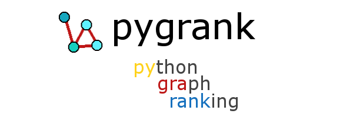

Fast node ranking algorithms on large graphs.
<br>
<small>Node score diffusion · Recommendation and ranking · Community structure · Link prediction · Graph signal processing</small>
<br>
<br>

**License:** Apache Software License
<br>**Author:** Emmanouil (Manios) Krasanakis
<br>**Dependencies:** `networkx`, `numpy`, `scipy`, `sklearn`, `wget`
<br>**Backends (optional):** `tensorflow`, `torch`, `torch_sparse`, `matvec` 
<br><small>*Externally install backends before using them.*</small>


[](https://codecov.io/gh/MKLab-ITI/pygrank)
[](https://pepy.tech/project/pygrank)

# :rocket: New features (after 0.2.10)
* More [datasets](documentation/datasets.md)

# :hammer_and_wrench: Installation
`pygrank` is meant to work with Python 3.9 or later. The latest version can be installed with pip per:
```
pip install --upgrade pygrank
```

To run the library on backpropagateable backends, 
either change the automatically created
configuration file (follow the instructions in the stderr console)
or run parts of your code within a
[context manager](https://book.pythontips.com/en/latest/context_managers.html)
to override other configurations like this:

```python
import pygrank as pg
with pg.Backend("tensorflow"):
    ... # run your pygrank code here
```

Otherwise, everything runs on top of `numpy` (this
is faster for forward passes). Node ranking algorithms 
can be defined outside contexts.

# :zap: Quickstart
Before looking at details, here is fully functional
pipeline that scores the importance of a node in relation to 
a list of "seed" nodes within a graph's structure:

```python
import pygrank as pg
graph, seeds, node = ...

pre = pg.preprocessor(assume_immutability=True, normalization="symmetric")
algorithm = pg.PageRank(alpha=0.85)+pre >> pg.Sweep() >> pg.Ordinals()
ranks = algorithm(graph, seeds)
print(ranks[node])
print(algorithm.cite())
```

The graph can be created with `networkx` or, for faster computations,
with the `pygrank.fastgraph` module. Nodes can hold any 
kind of object or data type (you don't need to convert them to integers).

The above snippet first defines a `preprocessor`, 
which typically controls how graph adjacency matrices are normalized.
In this case, a symmetric normalization
is applied (which is ideal for undirected graphs) and we also
assume graph immutability, i.e., that it will not change in the future.
When this assumption is declared, the preprocessor hashes a lot of
computations to considerably speed up experiments or autotuning.

The snippet uses the [chain operator](documentation/functional.md) >>
to wrap node ranking algorithms by various kinds of postprocessors
(you can also put algorithms into each other's constructors
if you are not a fan of functional programming).
The chain starts from a pagerank graph filter with diffusion parameter
0.85. Other types of filters and even automatically tuned ones can
be declared.

The full algorithm is run as a callable,
producing a map between nodes and values 
(in graph signal processing, such maps are called graph signals)
and the value of a particular node is printed. Graph signals can
also be created and directly parsed by algorithms, for example per:
```
signal = pg.to_signal(graph, {v: 1. for v in seeds})
ranks = algorithm(signal)
```

Finally, the snippet prints a recommended citation for the algorithm.

### More examples

[Simple example](documentation/showcase.md) <br>
[Big data FAQ](documentation/tips.md) <br>
[Downstream tasks](https://github.com/maniospas/pygrank-downstream) <br>


# :brain: Overview
Analyzing graph edges (links) between graph nodes can help rank/score
nodes based on proximity to structural or attribute-based communities 
of known example members.
With the introduction of graph signal processing and
[decoupled graph neural networks](https://dl.acm.org/doi/abs/10.1145/3442381.3449927) 
the importance of node ranking has drastically 
increased, as its ability to perform inductive learning by quickly
spreading node information through edges has been theoretically and experimentally
corroborated. For example, it can be used to make predictions based on few known
node attributes or the outputs of feature-based machine learning models.

`pygrank` is a collection of node ranking algorithms and practices that 
support real-world conditions, such as large graphs and heterogeneous
preprocessing and postprocessing requirements. Thus, it provides
ready-to-use tools that simplify deployment of theoretical advancements
and testing of new algorithms.

Some of the library's advantages are:
1. **Compatibility** with [networkx](https://github.com/networkx/networkx), plain [numpy](https://numpy.org), [tensorflow](https://www.tensorflow.org), [pytorch](https://pytorch.org), [matvec](https://github.com/maniospas/matvec).
2. **Datacentric** interfaces that do not require transformations to identifiers.
3. **Large** graph support with sparse data structures and scalable algorithms.
4. **Seamless** pipelines (e.g., operation [chains](documentation/functional.md)), from graph preprocessing up to benchmarking and evaluation.
5. **Modular** components to be combined and a functional chain interface for complex combinations.
6. **Fast** running time with highly optimized operations

# :link: Material
[Tutorials & Documentation](documentation/documentation.md) <br>
[Functional Interface](documentation/functional.md)

**Quick links**<br>
[Measures](documentation/measures.md) <br>
[Graph Filters](documentation/graph_filters.md) <br>
[Postprocessors](documentation/postprocessors.md) <br>
[Tuners](documentation/tuners.md) <br>
[Downloadable Datasets](documentation/datasets.md) <br>

**Backend resources**<br>
[numpy](https://numpy.org/) (default, no additional installation) <br>
[tensorflow](https://www.tensorflow.org/install) <br>
[pytorch](https://pytorch.org/get-started/locally) <br>
[torch_sparse](https://github.com/rusty1s/pytorch_sparse) <br>
[matvec](https://github.com/maniospas/matvec)

# :fire: Features
* Graph filters
* Community detection
* Link prediction
* Graph normalization
* Convergence criteria
* Postprocessing (e.g., fairness awareness)
* Evaluation measures
* Benchmarks
* Autotuning
* Graph Neural Network (GNN) support

# :thumbsup: Contributing
Feel free to contribute in any way, for example through the [issue tracker](https://github.com/MKLab-ITI/pygrank/issues) or by participating in [discussions]().
Please check out the [contribution guidelines](CONTRIBUTING.md) to bring modifications to the code base.
If so, make sure to **follow the pull checklist** described in the guidelines.
 
# :notebook: Citation
If `pygrank` has been useful in your research and you would like to cite it in a scientific publication, please refer to the following paper:
```
@article{krasanakis2022pygrank,
  author       = {Emmanouil Krasanakis, Symeon Papadopoulos, Ioannis Kompatsiaris, Andreas Symeonidis},
  title        = {pygrank: A Python Package for Graph Node Ranking},
  journal      = {SoftwareX},
  year         = 2022,
  month        = oct,
  doi          = {10.1016/j.softx.2022.101227},
  url          = {https://doi.org/10.1016/j.softx.2022.101227}
}
```
To publish research that makes use of provided methods,
please cite all [relevant publications](documentation/citations.md).
