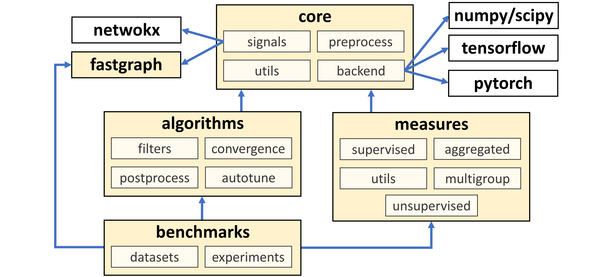

<center><h1>:hammer_and_wrench: Tutorials & Documentation</h1></center> 

## Table of Contents
1. [Table of Contents](#table-of-contents)
2. [Architecture](#architecture)
3. [Graph Signals](#graph-signals)
    + [Defining and Manipulating Graph Signals](#defining-and-manipulating-graph-signals)
    + [Implicit Use of Signals](#implicit-use-of-signals)
4. [Graph Filters](#graph-filters)
    + [Passing Graph Signals through Filters](#passing-graph-signals-through-filters)
    + [Graph Diffusion Principles](#graph-diffusion-principles)
    + [List of Filters](#list-of-filters)
    + [Convergence Criteria](#convergence-criteria)
    + [Graph Preprocessing and Normalization](#graph-preprocessing-and-normalization)
5. [Postprocessors](#postprocessors)
    + [Wrapping Postprocessors around Graph Filters](#wrapping-postprocessors-around-graph-filters)
    + [Types of Postprocessors](#types-of-postprocessors)
6. [Evaluation](#evaluation)
    + [List of Measures](#list-of-measures)
    + [Datasets](#datasets)
    + [Benchmarks](#benchmarks)
7. [Autotune](#autotune)
    + [List of Tuners](#list-of-tuners)
    + [Tuning Speedup with Optimization Dictionaries](#tuning-speedup-with-optimization-dictionaries)
8. [Applications](#applications)
    + [Algorithm Selection for Overlapping Community Recommendation](#algorithm-selection-for-overlapping-community-recommendation)
    + [Node Classification with Graph Neural Networks](#node-classification-with-graph-neural-networks)

For a brief overview of common terms found in this document
please refer to the [glossary](glossary.md).

# Architecture
`pygrank` has a clear separation of responsibilities between its 
different components. At the core of the package is the concept of 
*graph signals*, which represent machine learning data (like arrays and tensors) 
as they move through graphs. The package also has an abstracted 
backend that allows the manipulation of these signals under different
machine learning frameworks.

The `measures` module is responsible for defining different 
ways to evaluate the performance of prediction tasks on graphs. 
These methods include both supervised and unsupervised measures, 
and ways to combine multiple measures to get a better overall 
understanding of performance.

The `algorithms` modules defines different algorithms for 
ranking nodes on graphs. These algorithms all rely on 
*graph filters*, which diffuse the scores of individual 
nodes to the neighbors that are connected to them. 
The output of these filters can then be transformed or 
processed further to achieve different goals. A particularly 
useful feature of this module is its ability to automatically 
adjust certain filter parameters on-the-fly in order to optimize 
performance according to certain measures. This is referred to as *autotune*.

Finally, the `benchmarks` module  supports experiments that 
compare different node ranking algorithms against each other.



# Graph Signals
In `pygrank`, a *graph signal* is a way to organize numerical values 
that correspond to the nodes in a graph. These signals are used as 
inputs and outputs of node ranking algorithms. To make it easier to use 
the package, algorithms also accept other ways of representing 
signal data, such as maps of node values (e.g., `{'A': 3, 'C': 2}`)
that assume all other missing elements to represent zero values, 
numpy arrays (e.g., `np.array([3, 0, 2, 0])`), or other formats that 
are supported by the backend in use.  The output of node ranking algorithms
will always be in the form of the graph signal datatype.

When using other forms of data to identify signals, 
the graph itself also needs to be passed in the algorithms and they
will perform conversions to graph signal representations internally. 
If the input is a list, array, or tensor, the order of the values 
corresponds to the order in which the `networkx` package traverses 
the nodes in the graph. By convention, a signal of ones is understood 
if `None` is provided as signal data.

### Defining and Manipulating Graph Signals

As an example, we create a simple graph that includes nodes
'A' and 'C' with values of 3 and 2 respectively.
To create a graph signal with these values and 0 for other nodes
is done with the following code:

```python
import pygrank as pg
import networkx as nx
graph = nx.Graph()
graph.add_edge('A', 'B')
graph.add_edge('A', 'C')
graph.add_edge('C', 'D')
graph.add_edge('D', 'E')
signal = pg.to_signal(graph, {'A': 3, 'C': 2})
print(signal['A'], signal['B'])
# 3.0 0.0
```

Signal values can be accessed 
through the `signal.np` attribute, which hold `numpy` arrays by default. 
The attribute can hold different types of data depending on the *current*
backend being used. Avoid breaking any
pipelines used for backpropagation by manipulating signal values in
backends other than the ones they were first defined in.


Continuing from the previous example, in the following code
we normalize a graph signal's elements by dividing them with their sum.
Value changes are reflected by signal access.

```python
print(signal.np)
# [3. 0. 2. 0. 0.]
signal.np = signal.np / pg.sum(signal.np)
print([(k,v) for k,v in signal.items()])
# [('A', 0.6), ('B', 0.0), ('C', 0.4), ('D', 0.0), ('E', 0.0)]
```

Arithmetic and backend operations
are also directly applicable to signals, by implying the `np` attribute. 
For instance, the previous code snippet can be rewritten as:

```python
signal = signal / pg.sum(signal)
print([(k,v) for k,v in signal.items()])
# [('A', 0.6), ('B', 0.0), ('C', 0.4), ('D', 0.0), ('E', 0.0)]
```


# Graph Filters
Graph filters are tools that spread the node values stored in graph signals
through graphs by sending them to neighboring nodes and combining them there. 
This process produces new graph signals. The original graph signal values,
also called the *personalization*, often
indicate the likelihood that nodes have a certain property, such as being members 
of a structural or metadata community. Graph filters refine these 
initial estimates by providing improved probability scores for all nodes.

The following figure demonstrates a typical
node recommendation pipeline using `pygrank` that employs graph filters. 
This starts from a known personalization,
applies filters, potentially alters their outcome with
postprocessors, and eventually arrives at new node values. 
If filters are low-pass (they reduce graph eigenvalues), they smooth out the
personalization through the graph's structure.


### Passing graph signals through filters
Let us first define an personalized PageRank algorithm, which is graph filter
performing random walk with restart in the graph. If the personalization is
binary (i.e. all nodes have initial scores either 0 or 1) then this algorithm
is equivalent to a stochastic Markov process where it starts from the nodes
with initial scores 1 and iteratively jumpt to neighbors randomly. During this
process, it has a fixed probability *1-alpha* to restart and finally measures
the probability of arriving at each node.

We will use a restart probability at each step `1-alpha=0.01` and will
perform "col" (column-wise) normalization of the adjacency matrix in that
jumps to neighbors have equal probabilities (the alternative is "symmetric"
normalization where the probabilities of moving between two nodes are the
same for both movement directions). We will also stop the algorithm at numerical
tolerance 1.E-9. Smaller tolerances are more accurate in exactly solving
each algorithm's exact outputs but take longer to converge.

```python
import pygrank as pg
algorithm = pg.PageRank(alpha=0.99, normalization="col", tol=1.E-9)
```

Having defined this algorithm, we will now use the graph `G` and graph signal
`signal` generated in the previous section. Passing these through the pipeline
while ignoring any postprocessing for the time being can be done as:

```python
scores = algorithm(graph, signal)
# Exception: ('Could not converge within 100 iterations')
```

The code threw an exception, because for alpha values near 1 and high tolerance
PageRank is slow to converge. Convergence speed is also reduced by the graph being
sparsely connected (this does not happen for graphs with higher average node
degrees - e.g. 5). To address this issue, we can either set a laxer numerical
tolerance or simply provide a larger number of iterations the algorithm is allowed
to run for. For the sake of demonstration, we chose the second solution and allow
the algorithm to run for up to 2,000 iterations:

```python
algorithm = pg.PageRank(alpha=0.99, normalization="col", tol=1.E-9, max_iters=2000)
scores = algorithm(graph, signal)
print(list(scores.items()))
# [('A', 0.25613418536078547), ('B', 0.12678642237010243), ('C', 0.2517487443382047), ('D', 0.24436832596280528), ('E', 0.12096232196810223)]
```

We can see that both 'A' and 'C' end up with the higher scores,
which are approximately 0.25. 'D' forms a circle with these
in the graph's structure and thus, by merit of being structurally close,
is scored closely to these two as 0.24. Finally, the other two nodes
assume lower values.

In the above code, we could also pass to the `rank` method
the dictionary `{'A':1, 'C': 2}` in place
of the signal and the package would make the conversion internally.
Alternatively, if a graph signal is already defined,
the graph could be omitted, as shown next. We stress that this is possible 
only because the graph signal holds a reference to the graph it is tied to
and directly inputting other kinds of primitives would throw an error message.

```python
scores = algorithm(signal)
```

We now examine the structural relatedness of various nodes to the personalization:
```python
print(list(scores.items()))
# [('A', 0.25613418536078547), ('B', 0.12678642237010243), ('C', 0.2517487443382047), ('D', 0.24436832596280528), ('E', 0.12096232196810223)]
```


### Graph diffusion principles
The main principle
lies in recognizing that propagating a graph signal's vector (i.e. numpy array)
representation *p* one hop away in the graph is performed through the operation
*Mp*, where *M* is a normalization of the graph's adjacency matrix. To gain an
intuition, think of column-based normalization, where *Mp*
becomes an update of all node values by setting them as their
neighbors' previous average.

By this principle, *M<sup> n</sup>p* propagates the signal *p* a total of *n* hops
away. Weighting the importance of hops and aggregating their outcome through summation
yields the following graph signal processing operation:

*H(M)p* such that *H(M) = a<sub>0</sub>+a<sub>1</sub>M+a<sub>2</sub>M<sup>2</sup>+...*

where *H(M)* is called a *graph filter*.

### List of filters
An exhaustive list of ready-to-use graph filters can be
found [here](graph_filters.md). After initialization with the appropriate
parameters, these can be used interchangeably in the above example.

`pygrank` provides several graph filters. Their usage pattern consists
of instantiating them as algorithms `alg` and then calling them with 
`alg(graph, personalization)` or the alternative `alg(pg.to_signal(graph, personalization))`
to obtain posterior node signals based on diffusing the provided
personalization signal through the graph. However, the outcomes of graph
filters often require additional processing steps, for example to perform
normalization, improve their quality or apply fairness constraints.

We refer to the improvement of graph filter outcomes as postprocessing. 
Keep in mind though that some postprocessors may run the base filters
multiple times. Still, we recognize this as the same procedure, since
it maintains the base use case of wrapping around a base filter to improve
its outcome.

### Convergence criteria
All graph filter constructors have a `convergence` argument that
indicates an object to help determine their convergence criteria, such as type of
error and tolerance for numerical convergence. If no such argument is passed
to the constructor, a `pygrank.ConvergenceManager` object
is automatically instantiated by borrowing whichever extra arguments it can
from those passed to algorithm constructors. These arguments can be:
- `tol` to indicate the numerical tolerance level required for convergence (default is 1.E-6).
- `error_type` to indicate how differences between two graph signals are computed. The default value is `pygrank.Mabs` but any other supervised [measure](#evaluation) that computes the differences between consecutive iterations can be used. The string "iters" can also be used to make the algorithm stop only when max_iters are reached (see below).
- `max_iters` to indicate the maximum number of iterations the algorithm can run for (default is 100). This quantity works as a safety net to guarantee algorithm termination. 

Sometimes, it suffices to reach a robust node rank order instead of precise 
values. To cover such cases we have implemented a different convergence criterion
``RankOrderConvergenceManager`` that stops 
at a robust node order [krasanakis2020stopping]. This criterion is specifically intended to be used with PageRank 
as the base ranking algorithm and needs to know that algorithm's diffusion
rate ``alpha``, which is passed as its first argument.

```python
import pygrank as pg

G, personalization = ...
alpha = 0.85
ordered_ranker = pg.PageRank(alpha=alpha, convergence=pg.RankOrderConvergenceManager(alpha))
ordered_ranker = pg.Ordinals(ordered_ranker)
ordered_ranks = ordered_ranker(G, personalization)
```

:bulb: Since the node order is more important than the specific rank values,
a post-processing step has been added throught the wrapping expression
``ordered_ranker = pg.Ordinals(ordered_ranker)`` to output rank order. 


### Graph preprocessing and normalization
Graph filters all use the same default graph normalization scheme
that performs symmetric (i.e. Laplacian-like) normalization 
for undirected graphs and column-wise normalization that
follows a true probabilistic formulation of transition probabilities
for directed graphs, such as `DiGraph` instances. The type of
normalization can be specified by passing a `normalization`
argument to constructors of ranking algorithms. This parameter can 
assume values of:
* *"auto"* for the above-described default behavior
* *"col"* for column-wise normalization
* *"symmetric"* for symmetric normalization
* *"none"* for avoiding any normalization, for example because edge weights already hold the normalization.

In combination to the above types of normalization, ranking
algorithms can be made to perform the renormalization trick
often employed by graph neural networks,
which shrinks their spectrum by adding self-loops to nodes
before extracting the adjacency matrix and its normalization.
To enable this behavior, you can use `renormalization=True`
alongside any other `normalization` argument.

In all cases, adjacency matrix normalization involves the
computationally intensive operation of converting the graph 
into a scipy sparse matrix each time  the `rank(G, personalization)`
method of ranking algorithms is called. The `pygrank` package
provides a way to avoid recomputing the normalization
during large-scale experiments by the same algorithm for 
the same graphs by passing an argument `assume_immutability=True`
to the algorithms's constructor, which indicates that
the the graph does not change between runs of the algorithm
and hence computes the normalization only once for each given
graph, a process known as hashing.

:warning: Hashing only uses the Python object's hash method, 
so a different instance of the same graph will recompute the 
normalization if it points at a different memory location.

:warning: Do not alter graph objects after passing them to
`rank(...)` methods of algorithms with
`assume_immutability=True` for the first time. If altering the
graph is necessary midway through your code, create a copy
instance with one of *networkx*'s in-built methods and
edit that one.

For example, hashing the outcome of graph normalization to
speed up multiple calls to the same graph can be achieved
as per the following code:
```python
import pygrank as pg
graph, personalization1, personalization2 = ...
algorithm = pg.PageRank(alpha=0.85, normalization="col", assume_immutability=True)
ranks1 = algorithm(graph, personalization1)
ranks2 = algorithm(graph, personalization2) # does not re-compute the normalization
```

Sometimes, many different algorithms are applied on the
same graph. In this case, to prevent each one
from recomputing the hashing already calculated by others,
they can be made to share the same normalization method. This 
can be done by using a shared instance of the 
normalization preprocessing `pg.preprocessor`, 
which can be passed as the `preprocessor` argument of ranking algorithm
constructors. In this case, the `normalization`, `renormalization` 
and `assume_immutability`
arguments should be passed to the preprocessor and will be ignored by the
constructors (what would otherwise happen is that the constructors
would create a prerpocessor with these arguments).

Basically, when the default value `preprocessor=None` is passed to ranking algorithm
constructors, these create a new preprocessing instance
with the `normalization`, `renormalization` and `assume_immutability`
values passed
to their constructor. These two arguments are completely ignored
if a preprocessor instance is passed to the ranking algorithm.
Direct use of these arguments without needing to instantiate a
preprocessor was demonstrated in the previous code example.

Using the same outcome of graph preprocessing 
to speed up multiple rank calls to the same graph by
different ranking algorithms can be done as:
```python
import pygrank as pg
graph, personalization1, personalization2 = ...
pre = pg.preprocessor(normalization="col", assume_immutability=True)
algorithm1 = pg.PageRank(alpha=0.85, preprocessor=pre)
algorithm2 = pg.HeatKernel(alpha=0.85, preprocessor=pre)
ranks1 = algorithm1(graph, personalization1)
ranks2 = algorithm2(graph, personalization2) # does not re-compute the normalization
```

:bulb: When benchmarking, in the above code you can call `pre(graph)`
before the first `rank(...)` call to make sure that that call
does not also perform the first normalization whose outcome will
be hashed and immediately retrieved by subsequent calls.

# Postprocessors
Postprocessors wrap base graph filters to affect their outcome. Usage
of node ranking algorithms remains the same as for the original graph
filters.

### Wrapping postprocessors around graph filters
Let us consider a simple scenario where we want the graph signal outputted
by a filter to always be normalized so that its largest node score is one. For
this, we will consider the graph `G`, signal `signal` and filter `algorithm`,
as obtained from the previous example and will use the postprocessor 
`Normalize`.

There are two ways to apply postprocessors. The first is to simply
`transform` graph signals, such as the outcomes of graph filters. For example,
we can write:

```python
scores = algorithm(graph, signal)
normalized_scores = pg.Normalize().transform(scores)
print(list(normalized_scores.items()))
# [('A', 1.0), ('B', 0.4950000024069947), ('C', 0.9828783455187619), ('D', 0.9540636897749238), ('E', 0.472261528845582)]
```

This way is supported by postprocessors that perform simple data
transformations. However, others may need to re-run base graph filters,
in which case they can only be attached to the latter to wrap its
functionality. Furthermore, the `transform` method only works with 
graph signals as inputs, as it does not take the graph as an
argument to automatically make the conversion.

Thus, use of the above pattern should be minimized and instead
we can write the following equivalent, which works for **all** 
postprocessors:


```python
normalized_algorithm = pg.Normalize(algorithm)
normalized_scores = normalized_algorithm(graph, signal)
print(list(normalized_scores.items()))
# [('A', 1.0), ('B', 0.4950000024069947), ('C', 0.9828783455187619), ('D', 0.9540636897749238), ('E', 0.472261528845582)]
```

The `rank` method is used the same way as before, but the graph
filter is now nested inside the postprocessor. Multiple postprocessors 
may be applied with the same pattern. For example, performing
an element-wise exponential transformation of node scores
with the postprocessor `Transformer` *before* normalization
can be achieved as:

```python
new_algorithm = pg.Normalize(pg.Transformer(np.exp, algorithm))
new_scores = new_algorithm(graph, signal)
print(list(new_scores.items()))
# [('A', 1.0), ('B', 0.8786683440755908), ('C', 0.9956241609824301), ('D', 0.9883030876536782), ('E', 0.8735657648099558)]
```

:warning: Iterative postprocessors do not support the `transform`
method, as this requires rerunning ranking algorithms.

:bulb: Postprocessors that support the `transform` method automatically
match arguments to their types, even if provided in the wrong order.
For example all three of the following code lines do the same thing:

```python
scores1 = pg.Normalize(algorithm, "max")(graph, signal)
scores2 = pg.Normalize("max", algorithm)(graph, signal)
scores3 = pg.Normalize("max").transform(algorithm(graph, signal))
```


### Types of postprocessors
An exhaustive list of ready-to-use postprocessors can be
found [here](postprocessors.md). After initialization with the appropriate
parameters, these can be used interchangeably in the above examples.

There are many ways graph filter posteriors can be processed to provide
more meaningful data. Of the simpler ones are normalization constraints,
for example to set the maximal or the sum of posterior node values to
sum to 1. There also exist thresholding schemes, which can be used
for binary community detection, as well as methods to make node
comparisons non-parameteric by transforming scores to ordinalities.

Some more complex postprocessing mechanisms involve re-running the 
base filters with augmented personalization. This happens both for
seed oversampling postprocessors, which aim to augment node scores
by providing more example nodes, and for fairness-aware posteriors,
which aim to make node scores adhere to some fairness constraint, 
such as disparate impact.

:warning: Fairness-aware postprocessors always require an additional **keyword**
argument `sensitive=...` to be passed to their *rank* or *transform* methods. 


# Evaluation
There is often the need to assess the ability of node ranking algorithms to 
produce desired outcomes. To this end, `pygrank` provides a suite of measures
which can be used to assess node ranking algorithms, as well as comprehensive
code interfaces with which to quickly set up experiments of any scale to assess
the efficacy of new practices.

Most measures are either supervised in that they compare graph signal posteriors
with some known ground truth or unsupervised in that they explore whether
posteriors satisfy a desired property, such as low conductance or density.
Multiple measures can also be aggregated through the `pygrank.AM` and 
`pygrank.GM` classes, which respectively perform arithmetic and geometric
averaging of measure outcomes.

### List of measures
An exhaustive list of measures can be
found [here](measures.md). After initialization with the appropriate
parameters, these can be used interchangeably in the above example.

### Datasets
`pygrank` provides a variety of datasets to be automatically downloaded
and imported, but synthetically generated datasets have also been
[generated for pygrank](https://github.com/maniospas/pygrank-datasets).
To help researchers provide appropriate citations,
we provide messages in the error console pointing to respective sources.
Researchers can also add their own datasets by placing them in the loading
directory (usually a `data` directory in their project, alongside automatically
downloaded datasets). Please visit the repository of datasets
[generated for pygrank](https://github.com/maniospas/pygrank-datasets) for
a description of conventions needed to create new datasets - these follow
the pairs.txt and groups.txt conventions of the SNAP repository.

A comprehensive list of all datasets which are automatically downloaded by the project 
and their available types of data can 
be found [here](datasets.md). A lists of all dataset names can be obtained 
programmatically with the method `downloadable_small_datasets()`, but 
you can also use `downloadable_small_datasets()` to limit experiments
on datasets that run fastly (within seconds instead of minutes or tens of minutes)
in modern machines.

Given a list of datasets, these can be inputted to loader methods that
iteratively yield the outcome of loading. Five methods with the ability to load
incrementally more information are provided, where datasets lacking that information
are ommited:

1. `load_datasets_graph` Yields respective dataset graphs.
2. `load_datasets_one_community` Yields tuples of dataset names, graphs and node lists, where the lists correspond to one of the (structural or metadata) communities of graph nodes.
3. `load_datasets_all_communities` Yields the same tuples as before, but also traverses all possible datasets node communities (thus, there are many loading outcomes for each dataset). Community identifiers are appended to dataset names.
4. `load_datasets_multiple_communities` Yields tuples of dataset names, graphs and hashmaps, where the latter map community identifiers to lists of nodes. 
5. `load_feature_dataset` Yields respective tuples of graphs, features and node labels, where the last two are organized into numpy arrays whose lines correspond to graph nodes (based on the order the graphs are traversed).

:warning: To make sure that any kind of experiment is performed only adequately many data, communities with less than
1% of graph nodes are ommitted from loaders 1-4.

All the above loaders take as an argument a list of datasets and, if convenient,
a secondary argument of a directory location `path="data"`
(take care *not* to add a trailing slash) 
in which to download or load the datasets from. Loaders are iterables and thus they need to be re-defined to traverse
through datasets again. For example, the following code can be used to load datasets for overlapping community detection
given that each node community should be experimented on separately.

```python
import pygrank as pg
datasets = pg.downloadable_small_datasets()
print(datasets)
# ['citeseer', 'eucore', 'graph5', 'graph9', 'bigraph']
for dataset, graph, group in pg.load_datasets_all_communities(datasets):
    print(dataset, ":", len(group), "community members", len(graph), "nodes",  graph.number_of_edges(), "edges")
# REQUIRED CITATION: Please visit the url https://linqs.soe.ucsc.edu/data for instructions on how to cite the dataset citeseer in your research
# citeseer0 : 596 community members 3327 nodes 4676 edges
# citeseer1 : 668 community members 3327 nodes 4676 edges
# citeseer2 : 701 community members 3327 nodes 4676 edges
...
```


### Benchmarks
`pygrank` offers the ability to conduct benchmark experiments that compare
node ranking algorithms and parameters on a wide range of graphs. For example,
a simple way to obtain some fastly-running algorithms and small datasets and
compare them under the AUC measure would be per:

```python
import pygrank as pg
dataset_names = pg.downloadable_small_datasets()
print(dataset_names)
# ['citeseer', 'eucore']
algorithms = pg.create_demo_filters()
print(algorithms.keys())
# dict_keys(['PPR.85', 'PPR.9', 'PPR.99', 'HK3', 'HK5', 'HK7'])
loader = pg.load_datasets_one_community(dataset_names)
pg.benchmark_print(pg.benchmark(algorithms, loader, pg.AUC))
#                	 PPR.85  	 PPR.9  	 PPR.99  	 HK3  	 HK5  	 HK7 
# citeseer       	 .89     	 .89    	 .89     	 .89  	 .89  	 .89 
# eucore         	 .85     	 .71    	 .71     	 .91  	 .89  	 .83 
# graph9         	 1.00    	 1.00   	 1.00    	 1.00 	 1.00 	 1.00
# bigraph        	 .96     	 .77    	 .77     	 1.00 	 .98  	 .86 
# REQUIRED CITATION: Please visit the url https://linqs.soe.ucsc.edu/data for instructions on how to cite the dataset citeseer in your research
# REQUIRED CITATION: Please visit the url https://snap.stanford.edu/data/email-Eu-core.html for instructions on how to cite the dataset eucore in your research
# REQUIRED CITATION: Please visit the url https://github.com/maniospas/pygrank-datasets for instructions on how to cite the dataset graph5 in your research
# REQUIRED CITATION: Please visit the url https://github.com/maniospas/pygrank-datasets for instructions on how to cite the dataset graph9 in your research
# REQUIRED CITATION: Please visit the url https://github.com/maniospas/pygrank-datasets for instructions on how to cite the dataset bigraph in your research
```

In the above scheme customly-defined algorithms could also be added
or used in place of the `algorithms` dictionary.
For example, we could add an automatically-tuned
algorithm (more on these later) with default parameters per the following code and
then re-run experiments to compare this with alternatives.

```python
algorithms["Tuned"] = pg.ParameterTuner()
```

:warning: To run a new series of benchmark experiments, a new loader needs to be created.


# Autotune
Beyond the ability to compare node ranking algorithms,
we provide the ability to automatically tune node ranking 
algorithms or select the best ones with respect to optimizing a measure
based on the graph and personalization at hand. This process is abstracted
through a `pygrank.Tuner` base class, which wraps
any kind of node ranking algorithm. Ideally, this would wrap end-product
algorithms.

:bulb: Tuners differ from benchmarks in that best node ranking algorithms
can be selected on-the-fly.

Tuner instances with default arguments use commonly seen base settings.
For example, the following code separates training and evaluation
data of a provided personalization signal and then uses a tuner that
by default creates a `GenericGraphFilter` instance with ten parameters.

```python
import pygrank as pg
graph, personalization = ...
training, evaluation = pg.split(pg.to_signal(graph, personalization, training_samples=0.5))
scores_pagerank = pg.PageRank()(graph, training)
scores_tuned = pg.ParameterTuner()(graph, training)
auc_pagerank = pg.AUC(evaluation, exclude=training).evaluate(scores_pagerank)
auc_tuned = pg.AUC(evaluation, exclude=training).evaluate(scores_tuned)
assert auc_pagerank <= auc_tuned
# True
```

Specific algorithms can also be tuned on specific parameter values, given
a method to instantiate the algorithm from a given set of parameters
(at worst, a lambda expression). For example, the following code defines and runs
a tuner with the same training personalization of the
previous example. The tuner finds the optimal alpha value of personalized
PageRank that optimizes NDCG (tuners optimize AUC be default if no measure is provided).

```python
import pygrank as pg
graph, personalization = ...
algorithm_from_params = lambda params: pg.PageRank(alpha=params[0])
scores_tuned = pg.ParameterTuner(algorithm_from_params, 
                                     max_vals=[0.99], 
                                     min_vals=[0.5],
                                     measure=pg.NDCG).tune(personalization)
```

### List of tuners
An exhaustive list of ready-to-use tuners can be found [here](tuners.md).
After initialization with the appropriate
parameters, these can be used interchangeably in the above example.

### Tuning speedup with optimization dictionaries
Graph convolutions are the most computationally-intensive operations
node ranking algorithms employ, as their running time scales linearly with the 
number of network edges (instead of nodes). However, when tuners
aim to optimize algorithms involving graph filters extending the
`ClosedFormGraphFilter` class, graph filtering is decomposed into 
weighted sums of naturally occurring
Krylov space base elements {*M<sup>n</sup>p*, *n=0,1,...*}.

To speed up computation time (by many times in some settings) `pygrank`
provides the ability to save the generation of this Krylov space base
so that future runs do *not* recompute it, effectively removing the need
to perform graph convolutions all but once for each personalization.

:warning: When applying this speedup outside of tuners, it requires
explicitly passing a graph signal object to graph filters
(e.g. it does not work with dictionary inputs) since this is the only
way to hash both the personalization and the graph
on one persistent object.

To enable this behavior, a dictionary needs to be passed to closed form
graph filter constructors through an `optimization_dict` argument.
In most cases, tuners are responsible for delegating additional arguments
to default algorithms and this can be achieved with the following code.

```python
graph, personalization = ...
optimization_dict = dict()
tuner = pg.ParameterTuner(error_type="iters", 
                              num_parameters=20,
                              max_iters=20,
                              optimization_dict=optimization_dict)
scores = tuner(graph, personalization)
```

:warning: Similarly to the `assume_immutability=True` option
for preprocessors, this requires that graphs signals are not altered in
the interim, although it is possible to clear signal values.
In particular, to remove
allocated memory, you can keep a reference to the dictionary and clear
it afterwards with `optimization_dict.clear()`.

:warning: Using optimization dictionaries multiplies (e.g. at least doubles)
the amount of used memory, which the system may run out of for large graphs.

:bulb: The default algorithms provided by tuners make use of the class
*pygrank.SelfClearDict* instead of a normal dictionary. This keeps track only
of the last personalization and only optimizes runs for the last personalization.
This way optimization becomes fast while allocating the minimum memory required
for tuning.


# Applications

### Algorithm selection for overlapping community recommendation
`pygrank` provides the capability of automatically selecting the best algorithm among a list
of candidate ones. This can be achieved either with supervised measures (typically AUC)
for which a validation subset of nodes is withheld to determine the best algorithm
or with unsupervised measures. Then, algorithms can be used to automatically detect communities.

First, let us load a dataset with several communities, create training-test splits of those
and used the package to create a bunch of (normalized) graph filters.

```python
import pygrank as pg
_, graph, communities = next(pg.load_datasets_multiple_communities(["EUCore"], max_group_number=3))
train, test = pg.split(communities, 0.05)  # 5% of community members are known
algorithms = pg.create_variations(pg.create_demo_filters(), pg.Normalize)
```

We can now define two graph filters that automtatically select the best method with an
AUC-based supervised evalutation and a modularity-based unsupervised evaluation respectively.
In the second case, we set `fraction_of_training=1` to not withhold validation data from
the compared node ranking algorithms. It is important to note that algorithm normalization
helps modularity create comparable assessments between different algorithms.

```python
supervised_algorithm = pg.AlgorithmSelection(algorithms.values(), measure=pg.AUC)
modularity_algorithm = pg.AlgorithmSelection(algorithms.values(), fraction_of_training=1, measure=pg.Modularity().as_supervised_method())
```

We now run the aglorithms for all communities to report the average AUC on the test sets.
Testing is made to exclude original seed nodes to ensure that results are not biased.

```python
supervised_aucs = list()
modularity_aucs = list()
for seeds, members in zip(train.values(), test.values()):
    measure = pg.AUC(members, exclude=seeds)
    supervised_aucs.append(measure(supervised_algorithm(graph, seeds)))
    modularity_aucs.append(measure(modularity_algorithm(graph, seeds)))

print("Supervised", sum(supervised_aucs) / len(supervised_aucs))
print("Modularity", sum(modularity_aucs)/len(modularity_aucs))
```

For very few seed nodes (in this case, they are fewer than 5 in tested communities)
supervised evaluation lacks robustness, especially since removing seeds shaves off
a large portion of information from node ranking algorithms. This can be seen in 
the above example, where modularity-based algorithm selection outperformed the
supervised one. On the other hand, for more nodes in the training seeds (such as
10% of total community members) supervised evaluation is the better one.


### Node classification with graph neural networks
To support Graph Neural Network architectures, `pygrank` provides a mechanism
for propagating latent representations through graph filters. This takes as
input backend primitives organized into matrices, applies the graph filter on
each of their columns and merges the results into matrices of the same 
directions.

For example, a predict-then-propagate architecture [klicpera2018predict]
can be implemented in tensorflow with the following code:

```python
import tensorflow as tf
import pygrank as pg
from tensorflow.keras.layers import Dropout, Dense

pg.load_backend('tensorflow')  # forces propagation through the tensorflow pipeline

class APPNP(tf.keras.Sequential):
    def __init__(self, num_inputs, num_outputs, hidden=64):
        super().__init__([
            Dropout(0.5, input_shape=(num_inputs,)),
            Dense(hidden, activation="relu", kernel_regularizer=tf.keras.regularizers.L2(1.E-5)),
            Dropout(0.5),
            Dense(num_outputs, activation="relu") ])
        self.ranker = pg.PageRank(0.9, renormalize=True, assume_immutability=True,
            error_type="iters", max_iters=10) # force 10 iterations
        self.input_spec = None  # prevents some versions of tensorflow from checking call inputs

    def call(self, inputs, training=False):
        graph, features = inputs
        predict = super().call(features, training=training)
        propagate = self.ranker.propagate(graph, predict, graph_dropout=0.5 if training else 0)
        return tf.nn.softmax(propagate, axis=1)
```

In the above code, the `propagate` method of the graph filter is used to perform the propagation.
Additionally, we make use of the package's ability to perform renormalization of the
adjacency matrix and graph dropout in forward computations.

Since organizing GNN training can prove cumbersome for non-experts,
`pygrank` integrates helper methods to train GNNs for node classification.
These are abstracted, so that calls are the same, regardless of the employed
backend. Layer losses are parsed through layer regularizers for *tensorflow* 
or by setting a *loss* value to the trainable module in *pytorch*. Training
makes use of the same arguments, albeit if a custom optimizer is provided this
needs to be generated by the respective backend.

Given the previous implementation, in the next snippet we load a dataset with node
features and labels, separate nodes into a 60-20-20 training-validation-test
split and train the APPNP architecture with the helper methods:

```python
graph, features, labels = pg.load_feature_dataset('citeseer')
training, test = pg.split(list(range(len(graph))), 0.8)
training, validation = pg.split(training, 1-0.2/0.8)
pg.load_backend('tensorflow')  # explicitly load the appropriate backend
model = APPNP(features.shape[1], labels.shape[1])
pg.gnn_train(model, graph, features, labels, training, validation,
             optimizer = tf.optimizers.Adam(learning_rate=0.01))
```

Predictions are easy to make per traditional calls and `pygrank` provides
implementation of GNN accuracy, which is switched around based on the backend:

```python
predictions = model([graph, features])
print("Accuracy", pg.gnn_accuracy(labels, predictions, test))
```

