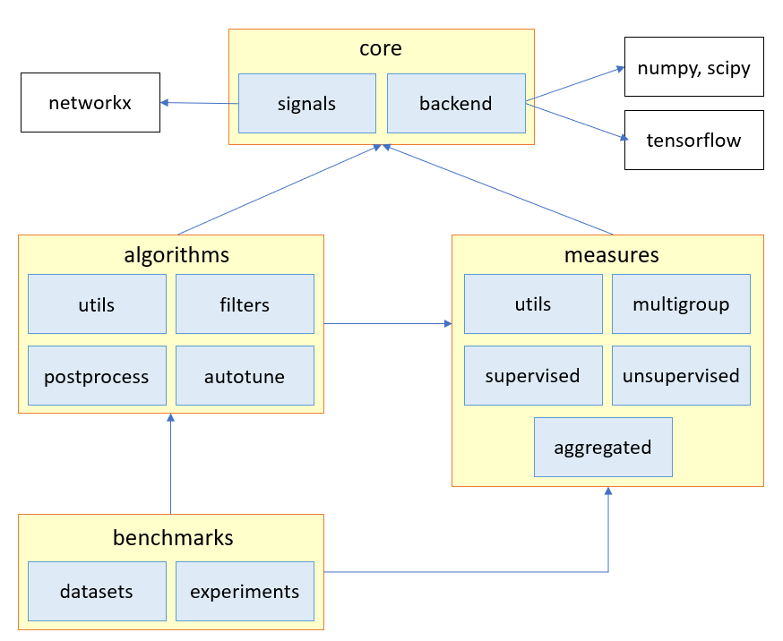

<center><h1>:thumbsup: Contributing</h1></center>


Feel free to provide any kind of code base contribution. This could include
implementing new publications, fixing, writting unit tests,
improving algorithms and extending the documentation.

You can also contribute through the [issue tracker](https://github.com/MKLab-ITI/pygrank/issues).
Many thanks to all existing and future contributors for their participation.

# :hammer_and_wrench: Workflow
The typical workflow for `pygrank` contributions comprises the following steps:
1. **Fork** the master branch from the GitHub repository.
2. **Clone** the fork locally (recommended: also copy the *pre-commit* file to *.git/hooks*).
3. **Edit** the library.
4. **Commit** changes.
5. **Push** changes to the fork.
6. **Create a pull request** from the fork back to the original master branch.

You can use any (virtual) environment to edit the local clone,
such as conda or the one provided by PyCharm.
The environment should come with Python 3.6 or later installed.
Make sure that both base library dependencies 
`networkx, numpy, scipy, sklearn, tqdm`
and `tensorflow` 
are installed and upgraded to their latest versions.

# :hammer_and_wrench: Architecture
`pygrank` adheres to a hierarchical architecture to manage inter-module dependencies,
which new code should maintain for import statements to work.
For example, do not design evaluation measures that depend on algorithms.
Rather, such components should be delegated to some of the other modules.
For reference, we re-iterate here the project's architecture. For more details,
please refer to the [documentation](documentation.md).



We ask that, when contributing new code, you try to import methods and 
classes through the highest-level 
architectural component they belong in that does not conflict with the code.
For example, to design a new filter you need import utility methods
from `pygrank.algorithms.utils`, since a higher-level import would create
self-recursions by trying to import all sub-modules. On the other hand,
in the same module you can safely import classes from `pygrank.measures`.


# :white_check_mark: Pull Checklist
Before creating a pull request, make sure that your submission checks the following points:
1. Class and method docstrings should adhere to [Google's docstring conventions](https://google.github.io/styleguide/pyguide.html#38-comments-and-docstrings).
Additionally, code examples should be prefaced by a line starting with the word
`Example ` and ending in `:` and their code lines start with `>>>`.
2. When implementing new or existing research (we are more than happy to accomodate this),
you are required to also update the library's [citations](citations.md).
3. New code should maintain *CamelCase* notation for classes and 
*lower_case_with_underscores* for methods and variables.
4. New files should be placed in appropriate modules and new methods and classes
can be accessed from the top level.
5. Module dependencies should comply on the above-described architecture.
6. **[optional]** Algorithms should exhibit near-linear
(e.g. polylog-linear) running times and memory allocation with respect to
the number of edges, to scale well to large graphs.
7. **[pre-commit]** Run `python docgenerator.py` to add new classes to the documentation.
8. **[pre-commit]** Pass all unit tests with no errors, unless your purpose
is to introduce new unit tests that reveal existing bugs.
Refrain from remodularizing the code unless absolutely necessary
(creating new packages is fine, but backwards compatibility of import statements
is mandatory).
9. **[pre-commit]** Unit tests should provide 100% code coverage.

**Steps 7-9 can be automated for commits to the master branch
by copying the `pre-commit` script file to the local folder `.git/hooks`**.


# :pencil2: Implementing New Node Ranking Algorithms
##### Which classes to subclass?
To create a new node ranking algorithm, you are required to subclass one of the
classes found in `pygrank.algorithms.abstract_filters`:
* `GraphFilter` identifies generic graph filters (is subclassed by the next two)
* `RecursiveGraphFilter` identifies graph filters that can be described with a recursive formula
* `ClosedFormGraphFilter` identifies graph filers that can be described in closed form

Please extend this documentation if a new family of node ranking algorithms is implemented.

##### Where to write code?
New abstract classes (e.g. that define families of new algorithms) should be placed
in the same module as the above ones. New algorithms should be placed in modules
`pygrank.algorithms.[family]`, where *family* is either an existing
submodule or a new one. For new submodules, make sure to provide access to
their classes through `pygrank.algorithms.__init__.py`
(this is **important**, as it helps `docgenerator.py` to  automatically create
documentation for new algorithms).

##### Which method(s) to override?
Depending on which class you subclass, you need to override and implement a
different method; more general `GraphFilter` classes need to implement at
least a step `_step(M, personalization, ranks, *args, **kwargs)`
method of that class with the correct arguments
that implements iterative convolutions through the methods provided by the
backend  (these can be imported from `pygrank.backend`). You can add any
arguments and keyword arguments corresponding to additional graph signals,
but take care to put all algortithm-describing parameters in the constructor.
Note that `personalization` and `ranks` in this method are **graph signals**
but the method is expected to return the output of backend calculations, 
which will be directly assigned to `ranks.np`. The other two abstract subclasses
partially implement this method to simplify definition of new filters.

For `RecursiveGraphFilter` subclasses, you only need to implement the method
`_formula(self, M, personalization, ranks, *args, **kwargs)`, which describes
an iterative formula describing the filter. Contrary to above, for this method
`personalization` and `ranks` are **backend primitives**. Similarly to before,
it should also return a backend primitive.

For `ClosedFormGraphFilter` subclasses, you only need to implement the method
`_coefficient(self, previous_coefficient)` which calculates the next coefficient
*a<sub>n</sub>* of the closed form graph filter
*a<sub>0</sub>+a<sub>1</sub>M+a<sub>2</sub>M<sup>2</sup>+...*
given that the previous coefficient is *a<sub>n-1</sub>*, where the latter
is inputted as *None* when *a<sub>0</sub>* is being calculated. It may be
easier to use `n = self.convergence.iteration-1` to explicitly calculate the 
returned value.


##### How to structure constructors?
Constructors of graph filters should pass extra arguments to parent classes.
This ensures that new algorithms share the same breadth of customization
as parent classes. Only additional arguments not parsed by parent classes
need to be documented
(inherited arguments will be automatically added when `docgenerator.py`
is used to construct documentation). Try to parameterize constructors
as much as possible, to ensure that researchers can easily try different
variations.

As an example, the following snippet
introduces a new algorithm that performs a non-recursive
implementation of personalized PageRank based on the recursion
*a<sub>0</sub> = 1-alpha*, *a<sub>n</sub>=alpha a<sub>n-1</sub>* for *n>0*:
 

```python
class NewAlgorithm(ClosedFormGraphFilter):
    def __init__(self, alpha=0.85, **kwargs):
        """
        Instantiates the new algorithm.
        Args:
            alpha: Optional. The new algorithm's parameter. Default value is 0.85.
        """
        super().__init__(**kwargs)
        self.alpha = alpha
    
    def _coefficient(self, previous_coefficient):
        if previous_coefficient is None:
            return 1-self.alpha
        return previous_coefficient*self.alpha
    ...
```

Do not forget to follow the previously outlined pull checklist.

# :pencil2: Implementing New Postprocessors
#### Which class to subclass?
Postprocessors need to subclass the abstract
`pygrank.algorithms.postprocess.Postprocessor`
class.

#### Which method to override?
Postprocessors need to subclass the method `_transform(self, ranks)`
where `ranks` is a graph signal -typically the outcome of some other
node ranking algorithm (e.g. a graph filter). Implementations of this
method can return any kind of data convertible to graph signals,
such as dictionaries or backend primitives. When possible, use the latter
(i.e. manipulate `ranks.np` with backend operations and return the result)
to ensure faster computations through the graph filter pipeline, for example
when iterative postprocessors are applied afterwards.

# :pencil2: Implementing New Measures
TODO


# :pencil2: Implementing New Benchmarks
TODO

# :pencil2: Implementing New Tuners
TODO
