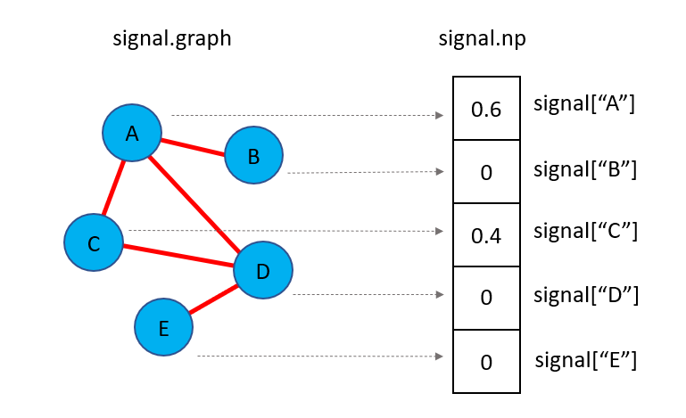
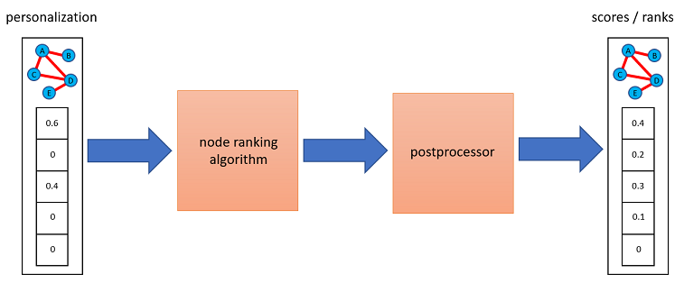

<center><h1 style=font-size:200px>Documentation</h1></center> 


# Graph Signals
Graph signals are a way to organize numerical values corresponding to respective
nodes. They are returned by ranking algorithms, but for ease-of-use,
you can also pass to ranking algorithms maps of node values
(e.g.  `{'A': 3, 'C': 2}`) or numpy arrays (e.g. `np.array([3, 0, 2, 0])`
where positions correspond to the order networkx traverse graph nodes) to them.
If so, these representations are converted internally to graph signals based on
whatever graph information is available. In fact, we encourage using these
representations to avoid

**If** *tensorflow* or *pytorch* are set as the backends of choice,
you can also construct graph signals instead of numpy arrays.

### :zap: Define and Manipulate a Graph Signal
As an example, let us create a simple graph
and assign to nodes 'A' and 'C' the values *3* and *2* respectively,
where all other nodes are assigned zeroes.
To create a graph signal holding this information we can write:

```python
>>> from pygrank.algorithms.utils.graph_signal import to_signal
>>> import networkx as nx
>>> G = nx.Graph()
>>> G.add_edge('A', 'B')
>>> G.add_edge('A', 'C')
>>> G.add_edge('C', 'D')
>>> G.add_edge('D', 'E')
>>> signal = to_signal(G, {'A': 3, 'C': 2})
>>> print(signal['A'], signal['B'])
3.0 0.0
```

If is possible to directly access graph signal values as objects of the
respective backend through a `signal.np` attribute. For example, if the
default *numpy* backend is used, this attribute holds a numpy array. 
Continuing from the previous example,
in the following code we divide a graph signal's elements with their sum.
Value changes are reflected to the values being accessed.

```python
>>> from pygrank import backend
>>> print(signal.np)
[3. 0. 2. 0. 0.]
>>> signal.np = signal.np / backend.sum(signal.np)
>>> print([(k,v) for k,v in signal.items()])
[('A', 0.6), ('B', 0.0), ('C', 0.4), ('D', 0.0), ('E', 0.0)]
```




### :hammer_and_wrench: Details
For ease of use, the library can directly parse
dictionaries that map nodes to values, e.g. the dictionary
`{'A':0.6,'C':0.4}` were ommitted nodes correspond to zeroes,
or numpy arrays with the same number of elements as graph nodes,
e.g. `np.ndarray([node_scores.get(v, 0) for v in G])` where `G`
is the networkx graph passed to node ranking algorithms.
When either of these two conventions is used,
node ranking algorithms automatically convert them to graph signals.

At the same time, the output of `rank(...)` methods are always graph signals.
This datatype implements the same methods as a dictionary and can
be used interchangeably, whereas access to a numpy array storing
corresponding node values can be obtained through the object attribute
`signal.np`.


# Graph Filters
Graph filters are ways to diffuse graph signals through graphs by sending
node values to their neighbors and aggregating them there. This process
effectively ends up with new graph signals. The original graph signals,
often called *personalization* usually hold values proportional to the probabilities
that nodes exhibit a property of interest (e.g. are members of an attribute-based
or structural communities) and zero when they either do not exhibit that
property at all or it is unknown if they do so. Then, the resulting scores 
make an improved estimatation for all nodes proportional to the probability
that they also exhibit the property of interest.

Based on this understanding, the following figure demonstrates a typical
node recommendation pipeline using `pygrank`. This starts from a known
personalization signal,
applies graph filters, potentially improves their outcome with
postprocessing mechanisms and eventually arives at new node scores. 
In this procedure, filters effectively smooth out the
personalization through the graph's structure.



The structural importance of nodes according to the filters used corresponds
to their scores if a signal of equal values (e.g. ones) is provided as input. By
convention, a signal of ones is understood if `None` is provided.

### :zap: Pass a Graph Signal through a Filter
Let us first define an personalized PageRank algorithm, which is graph filter
performing random walk with restart in the graph. If the personalization is
binary (i.e. all nodes have initial scores either 0 or 1) then this algorithm
is equivalent to a stochastic Markov process where it starts from the nodes
with initial scores 1 and iteratively jumpt to neighbors randomly. During this
process, it has a fixed probability *1-alpha* to restart and finally measures
the probability of arriving at each node.

We will use a restart probability at each step `1-alpha=0.01` and will
perform "col" (column-wise) normalization of the adjacency matrix in that
jumps to neighbors have equal probabilities (the alternative is "symmetric"
normalization where the probabilities of moving between two nodes are the
same for both movement directions). We will also stop the algorithm at numerical
tolerance 1.E-9. Smaller tolerances are more accurate in exactly solving
each algorithm's exact outputs but take longer to converge.

```python
>>> from pygrank.algorithms import adhoc
>>> algorithm = adhoc.PageRank(alpha=0.99, normalization="col", tol=1.E-9)
```

Having defined this algorithm, we will now use the graph `G` and graph signal
`signal` generated in the previous section. Passing these through the pipeline
while ignoring any postprocessing for the time being can be done as:

```python
>>> scores = algorithm.rank(G, signal)
Exception: ('Could not converge within 100 iterations')
```

The code threw an exception, because for alpha values near 1 and high tolerance
PageRank is slow to converge. Convergence speed is also reduced by the graph being
sparsely connected (this does not happen for graphs with higher average node
degrees - e.g. 5). To address this issue, we can either set a laxer numerical
tolerance or simply provide a larger number of iterations the algorithm is allowed
to run for. For the sake of demonstration, we chose the second solution and allow
the algorithm to run for up to 2,000 iterations:

```python
>>> algorithm = adhoc.PageRank(alpha=0.99, normalization="col", tol=1.E-9, max_iters=2000)
>>> scores = algorithm.rank(G, signal)
>>> print(list(scores.items()))
[('A', 0.25613418536078547), ('B', 0.12678642237010243), ('C', 0.2517487443382047), ('D', 0.24436832596280528), ('E', 0.12096232196810223)]
```

We can see that both 'A' and 'C' end up with the higher scores,
which are approximately 0.25. 'D' forms a circle with these
in the graph's structure and thus, by merit of being structurally close,
is scored closely to these two as 0.24. Finally, the other two nodes
assume lower values.

In the above code, we could also pass to the `rank` method
the dictionary `{'A':1, 'C': 2}` in place
of the signal and the library would make the conversion internally.
Alternatively, if a graph signal is already defined,
the graph could be ommited, as shown next. We stress that this is possible only because
the graph signal holds a reference to the graph it is tied to.

```python
>>> scores = algorithm.rank(personalization=signal)
```

We now examine the structural relatedness of various nodes to the personalization:
```python
>>> print(list(scores.items()))
[('A', 0.25613418536078547), ('B', 0.12678642237010243), ('C', 0.2517487443382047), ('D', 0.24436832596280528), ('E', 0.12096232196810223)]
```


### :brain: Explanation
The main principle
lies in recognizing that propagating a graph signal's vector (i.e. numpy array)
represntation `p` one hop away in the graph is performed through the operation
`Mp`, where `M` is a normalization of the graph's adjacency matrix. To gain an
intuition, think of column-based normalization, where `Mp`
becomes an update of all node values by setting them as their
neighbors' previous average.

### :hammer_and_wrench: Details
The library provides several graph filters. Their usage pattern consists
of instantiating them and then calling their `rank(graph, personalization)`
method to obtain posterior node signals based on diffusing the provided
personalization signal through the graph. However, the outcomes of graph
filters often require additional processing steps, for example to perform
normalization, improve their quality or apply fairness constraints.

We refer to the improvement of graph filter outcomes as postprocessing. 
Keep in mind though that some postprocessors may run the base filters
multiple times. Still, we recognize this as the same procedure, since
it maintains the base use case of wrapping around a base filter to improve
its outcome.

### :scroll: List of Graph Filters
An exhaustive list of ready-to-use graph filters can be
found [here](graph_filters.md). After initialization with the appropriate
parameters, these can be used interchangeably in the above example.

# Postprocessors
Postprocessors wrap base graph filters to affect their outcome. Usage
of the original filters remains identical.

### :zap: Wrapping Postprocessors around Graph Filters
Let us consider a simple scenario where we want the graph signal outputted
by a filter to always be normalized so that its largest node score is one. For
this, we will consider the graph `G`, signal `signal` and filter `algorithm`,
as obtained from the previous example and will use the postprocessor 
`Normalize`.

There are two ways to apply postprocessors. The first is to simply
`transform` graph signals, such as the outcomes of graph filters. For example,
we can write:

```python
>>> from pygrank.algorithms.postprocess import Normalize
>>> scores = algorithm.rank(G, signal)
>>> normalized_scores = Normalize().transform(scores)
>>> print(list(normalized_scores.items()))
[('A', 1.0), ('B', 0.4950000024069947), ('C', 0.9828783455187619), ('D', 0.9540636897749238), ('E', 0.472261528845582)]
```

This way is supported by postprocessors that perform simple data
transformations. However, others may need to re-run base graph filters,
in which case they can only be attached to the latter to wrap its
functionality. Furthermore, the `transform` method only works with 
graph signals as inputs, as it does not take the graph as an
argument to automatically make the conversion.

Thus, use of the above pattern should be minimized and instead
we can write the following equivalent, which works for **all** 
postprocessors:


```python
>>> from pygrank.algorithms.postprocess import Normalize
>>> normalized_algorithm = Normalize(algorithm)
>>> normalized_scores = normalized_algorithm.rank(G, signal)
>>> print(list(normalized_scores.items()))
[('A', 1.0), ('B', 0.4950000024069947), ('C', 0.9828783455187619), ('D', 0.9540636897749238), ('E', 0.472261528845582)]
```

The `rank` method is used the same way as before, but the graph
filter is now nested inside the postprocessor. Multiple postprocessors 
may be applied with the same pattern. For example, performing
an element-wise exponential transformation of node scores
with the postprocessor `Transformer` *before* normalization
can be achieved as:

```python
>>> from pygrank.algorithms.postprocess import Normalize, Transformer
>>> import numpy as np
>>> new_algorithm = Normalize(Transformer(np.exp, algorithm))
>>> new_scores = new_algorithm.rank(G, signal)
>>> print(list(new_scores.items()))
[('A', 1.0), ('B', 0.8786683440755908), ('C', 0.9956241609824301), ('D', 0.9883030876536782), ('E', 0.8735657648099558)]
```


### :brain: Explanation
There are many ways graph filter posteriors can be processed to provide
more meaningful data. Of the simpler ones are normalization constraints,
for example to set the maximal or the sum of posterior node values to
sum to 1. There also exist thresholding schemes, which can be used
for binary community detections, as well as methods to make node
comparisons non-parameteric by transforming scores to ordinalities.

Some more complex postprocessing mechanisms involve re-running the 
base filters with augmented personalization. This happens both for
seed oversampling postprocessors, which aim to augment node scores
by providing more example nodes, and for fairness-aware posteriors,
which aim to make node scores adhere to some fairness constraint, 
such as disparate impact.

### :scroll: List of Postprocessors
An exhaustive list of ready-to-use postprocessors can be
found [here](postprocessors.md). After initialization with the appropriate
parameters, these can be used interchangeably in the above example.


# Evaluation

### :zap: Examples

### :brain: Evaluation Measures

### :brain: Benchmarks

### :scroll: List of Benchmarks

### :scroll: List of Measures
An exhaustive list of measures can be
found [here](measures.md). After initialization with the appropriate
parameters, these can be used interchangeably in the above example.
