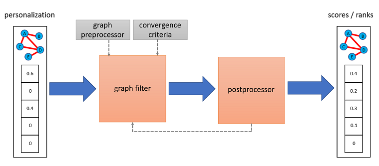

<center><h1 style=font-size:200px>Documentation</h1></center> 


# Graph Signals
Graph signals are a way to organize numerical values corresponding to respective
nodes. They
are returned by ranking algorithms, but for ease-of-use you can also pass
maps of node values (e.g.  `{"A": 3, "C": 2}`)
or numpy arrays (e.g. `np.array([3, 0, 2, 0])` where positions correspond
to the order networkx traverse graph nodes) to them. If so,
these representations are converted internally to graph signals based on
whatever graph information is available.

### :zap: Example
As an example, let us create a simple line graph of three edges `"A", "B", "C"` 
and assign to the first and the last one the values *3* and *2* respectively.
To create a graph signal holding this information we can write:

```python
>>> from pygrank.algorithms.utils.graph_signal import to_signal
>>> import networkx as nx
>>> G = nx.Graph()
>>> G.add_edge("A", "B")
>>> G.add_edge("A", "C")
>>> G.add_edge("C", "D")
>>> G.add_edge("D", "E")
>>> signal = to_signal(G, {"A": 3, "C": 2})
>>> print(signal["A"], signal["B"])
3.0 0.0
```

If is possible to directly access graph signal values as numpy arrays
through a `signal.np` attribute. Continuing from the previous example,
in the following code we divide a graph signal's elements with their sum.
Value changes are reflected to the values being accessed.

```python
>>> print(signal.np)
[3. 0. 2.]
>>> signal.np /= signal.np.sum()
>>> print([(k,v) for k,v in signal.items()])
[('A', 0.6), ('B', 0.0), ('C', 0.4), ('D', 0.0), ('E', 0.0)]
```


### :hammer_and_wrench: Details
For ease of use, the library can directly parse
dictionaries that map nodes to values, e.g. `{"A":0.8,"B":0.5}`
where ommitted nodes are considered to correspond to zeroes,
or numpy arrays with the same number of elements as graph nodes,
e.g. `np.ndarray([node_scores.get(v, 0) for v in graph])` where `graph` is the networkx
graph passed to node ranking algorithms. When either of these two conventions is used,
node ranking algorithms automatically convert them to graph signals.

At the same time, the output of `rank(...)` methods are always graph signals. It must
be noted that this datatype implements the same methods as a dictionary and can
be used interchangeably, whereas access to a numpy array storing corresponding node
values can be obtained through the object attribute `signal.np`.


# Node Ranking Algorithms
Graph filters are ways to diffuse graph signals through graphs by sending
node values to their neighbors and aggregating them there. This process
effectively ends up with new graph signals. The original graph signals,
often called *personalization* usually hold values proportional to the probabilities
that nodes exhibit a property of interest (e.g. are members of an attribute-based
or structural communities) and zero when they either do not exhibit that
property at all or it is unknown if they do so. Then, the resulting scores 
make an improved estimatation for all nodes proportional to the probability
that they also exhibit the property of interest.

Based on this understanding, the following figure demonstrates a typical
node recommendation pipeline using `pygrank`. This starts from a known
personalization signal,
applies node ranking algorithms, potentially improves their outcome with
postprocessing mechanisms and eventually arives at new node scores. 
In this procedure, node ranking algorithms effectively smooth out the
personalization through the graph's structure.



The structural importance of nodes according to the ranking algorithm corresponds
to their scores if a signal of equal values (e.g. ones) is provided as input. By
convention, a signal of ones is inputted to all algorithms if `None` is provided.

### :zap: Example
Let us first define an personalized PageRank algorithm, which is graph filter
performing random walk with restart in the graph. If the personalization is
binary (i.e. all nodes have initial scores either 0 or 1) then this algorithm
is equivalent to a stochastic Markov process where it starts from the nodes
with initial scores 1 and iteratively jumpt to neighbors randomly. During this
process, it has a fixed probability *1-alpha* to restart and finally measures
the probability of arriving at each node.

We will use a restart probability at each step `1-alpha=0.01` and will
perform "col" (column-wise) normalization of the adjacency matrix in that
jumps to neighbors have the same probability (the alternative is "symmetric"
normalization where the prbabilities of moving between two nodes are the
same no matter the direction). We  will also stop the algorithm at numerical
tolerance 1.E-9. Smaller tolerances are more accurate in exactly solving
each algorithm's assumptions but take longer to converge.

```python
>>> from pygrank.algorithms import adhoc
>>> algorithm = adhoc.PageRank(alpha=0.99, normalization="col", tol=1.E-9)
```

Having defined this algorithm, we will now use the graph `G` and graph signal
`signal` generated in the previous graph signal section. Passing the original
signal through the pipeline, ignoring the postprocessing step for the time being,
can be done as:

```python
>>> scores = algorithm.rank(G, signal)
```

In this code, we could also pass the dictionary `{"A":1, "C": 2}` in place
of the signal and it would make the conversion internally. If a graph signal
is defined though, the graph needs not be provided again.

```python
>>> scores = algorithm.rank(personalization=signal)
```

### :brain: Explanation
The main principle
lies in recognizing that propagating a graph signal's vector (i.e. numpy array)
represntation `p` one hop away in the graph is performed through the operation
`Mp`, where `M` is a normalization of the graph's adjacency matrix. To gain an
intuition, think of column-based normalization, where `Mp`
becomes an update of all node values by setting them as their
neighbors' previous average.

### :hammer_and_wrench: Details
The library provides several graph filters. Their usage pattern consists
of instantiating them and then calling their `rank(graph, personalization)`
method to obtain posterior node signals based on diffusing the provided
personalization signal through the graph.

### :scroll: List of Graph Filters
An exhaustive list of all ready-to-use graph filters can be
found [here](graph_filters.md). After initialization with the appropriate
parameters, these can be used interchangeably in the above example.

# Postprocessors
Postprocessors wrap base graph filters to affect their outcome. Usage
of the original filters remains identical.

### :zap: Example

### :brain: Explanation
There are many ways graph filter posteriors can be processed to provide
more meaningful data. Of the simpler ones are normalization constraints,
for example to set the maximal or the sum of posterior node values to
sum to 1. There also exist thresholding schemes, which can be used
for binary community detections, as well as methods to make node
comparisons non-parameteric by transforming scores to ordinalities.

Some more complex postprocessing mechanisms involve re-running the 
base filters with augmented personalization. This happens both for
seed oversampling postprocessors, which aim to augment node scores
by providing more example nodes, and for fairness-aware posteriors,
which aim to make node scores adhere to some fairness constraint, 
such as disparate impact.

### :scroll: List of Graph Filters
An exhaustive list of all ready-to-use postprocessors can be
found [here](postprocessors.md). After initialization with the appropriate
parameters, these can be used interchangeably in the above example.


# Evaluation

### :zap: Examples

### :brain: Evaluation Measures

### :brain: Benchmarks

### :scroll: List of Benchmarks

### :scroll: List of Evaluation Measures
