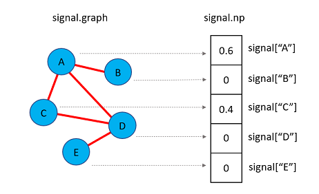

<center><h1>:hammer_and_wrench: Documentation</h1></center> 

## Table of Contents
1. [Table of Contents](#table-of-contents)
2. [Architecture](#architecture)
3. [Graph Signals](#graph-signals)
    + [Defining and Manipulating Graph Signals](#defining-and-manipulating-graph-signals)
    + [Implicit Use of Signals](#implicit-use-of-signals)
4. [Graph Filters](#graph-filters)
    + [Passing Graph Signals through Filters](#passing-graph-signals-through-filters)
    + [Graph Difusion Principles](#graph-diffusion-principles)
    + [Types of Filters](#types-of-filters)
    + [Convergence Criteria](#convergence-criteria)
    + [Graph Preprocessing](#graph-preprocessing)
5. [Postprocessors](#postprocessors)
    + [Wrapping Postprocessors around Graph Filters](#wrapping-postprocessors-around-graph-filters)
    + [Types of Postprocessors](#types-of-postprocessors)
6. [Evaluation](#evaluation)
7. [Autotune](#autotune)

For a brief overview of common terms found in this document
please refer to the [glossary](glossary.md).

# Architecture
`pygrank` is designed with a hierarchical architecture in mind, where the roles
of source code components can be clearly separated. At the core of the library
lie the concept of graph signals, which wrap machine learning primitives
(e.g. numpy arrays or tensorflow tensors) to be propagated through graphs.
Whatever these primitives may be, they can be manipulated through an 
abstracted backend.

Then, a separate defines several measures that can be used to assess the outcome
of prediction tasks on graphs. These include both supervised and unsupervised measures,
as well as ways to combine various measures (e.g. AUC and fairness-aware pRule that
assesses disparate impact) to quantify the efficacy of multiclass predictions.

Of course, a module is delegated to defining node ranking algorithms on graphs.
The take the form of graph filters, the outcome of which can be postprocessed 
towards various objectives by manipulating their outcome or applying iterative
schemes that edit algorithm inputs. A particularly useful part of the module
is the ability to automatically tune parameters on-the-fly, in a computationally
efficient manner. We refer to this practice as *autotune*.

Finally, a separate module is used to support benchmarking experiments that compare
various node ranking algorithms.


# Graph Signals
Graph signals are a way to organize numerical values corresponding to respective
nodes. They are returned by ranking algorithms, but for ease-of-use,
you can also pass to ranking algorithms maps of node values
(e.g.  `{'A': 3, 'C': 2}`) or numpy arrays (e.g. `np.array([3, 0, 2, 0])`
where positions correspond to the order networkx traverse graph nodes) to them.
If so, these representations are converted internally to graph signals based on
whatever graph information is available. In fact, we encourage using these
representations to avoid

**If** *tensorflow* or *pytorch* are set as the backends of choice,
you can also construct graph signals by passing tensors of those
libraries instead of numpy arrays.

### Defining and Manipulating Graph Signals
As an example, let us create a simple graph
and assign to nodes 'A' and 'C' the values *3* and *2* respectively,
where all other nodes are assigned zeroes.
To create a graph signal holding this information we can write:

```python
>>> import pygrank as pg
>>> import networkx as nx
>>> graph = nx.Graph()
>>> graph.add_edge('A', 'B')
>>> graph.add_edge('A', 'C')
>>> graph.add_edge('C', 'D')
>>> graph.add_edge('D', 'E')
>>> signal = pg.to_signal(graph, {'A': 3, 'C': 2})
>>> print(signal['A'], signal['B'])
3.0 0.0
```

If is possible to directly access graph signal values as objects of the
respective backend through a `signal.np` attribute. For example, if the
default *numpy* backend is used, this attribute holds a numpy array. 
Continuing from the previous example,
in the following code we divide a graph signal's elements with their sum.
For this, we use of the package's backend.
Value changes are reflected to the values being accessed.

```python
>>> print(signal.np)
[3. 0. 2. 0. 0.]
>>> signal.np = signal.np / pg.sum(signal.np)
>>> print([(k,v) for k,v in signal.items()])
[('A', 0.6), ('B', 0.0), ('C', 0.4), ('D', 0.0), ('E', 0.0)]
```




### Implicit Use of Signals
For ease of use, the library can directly parse
dictionaries that map nodes to values, e.g. the dictionary
`{'A':0.6,'C':0.4}` were omitted nodes correspond to zero scores,
or numpy arrays with the same number of elements as graph nodes,
e.g. `numpy.ndarray([node_scores.get(v, 0) for v in G])` where `G`
is the networkx graph passed to node ranking algorithms.
When either of these two conventions is used,
node ranking algorithms automatically convert them to graph signals.

At the same time, the outputs of `rank(...)` methods are always graph signals.
This datatype implements the same methods as a dictionary and can
be used interchangeably, whereas access to a numpy array storing
corresponding node values can be obtained through the object attribute
`signal.np`.

# Graph Filters
Graph filters are ways to diffuse graph signals through graphs by sending
node values to their neighbors and aggregating them there. This process
effectively ends up with new graph signals. The original graph signals,
often called *personalization* usually hold values proportional to the probabilities
that nodes exhibit a property of interest (e.g. are members of an attribute-based
or structural communities) and zero when they either do not exhibit that
property at all or it is unknown if they do so. Then, the resulting scores 
make an improved estimatation for all nodes proportional to the probability
that they also exhibit the property of interest.

Based on this understanding, the following figure demonstrates a typical
node recommendation pipeline using `pygrank`. This starts from a known
personalization signal,
applies graph filters, potentially improves their outcome with
postprocessing mechanisms and eventually arives at new node scores. 
In this procedure, filters effectively smooth out the
personalization through the graph's structure.


The structural importance of nodes according to the filters used corresponds
to their scores if a signal of equal values (e.g. ones) is provided as input. By
convention, a signal of ones is understood if `None` is provided.

### Passing Graph Signals through Filters
Let us first define an personalized PageRank algorithm, which is graph filter
performing random walk with restart in the graph. If the personalization is
binary (i.e. all nodes have initial scores either 0 or 1) then this algorithm
is equivalent to a stochastic Markov process where it starts from the nodes
with initial scores 1 and iteratively jumpt to neighbors randomly. During this
process, it has a fixed probability *1-alpha* to restart and finally measures
the probability of arriving at each node.

We will use a restart probability at each step `1-alpha=0.01` and will
perform "col" (column-wise) normalization of the adjacency matrix in that
jumps to neighbors have equal probabilities (the alternative is "symmetric"
normalization where the probabilities of moving between two nodes are the
same for both movement directions). We will also stop the algorithm at numerical
tolerance 1.E-9. Smaller tolerances are more accurate in exactly solving
each algorithm's exact outputs but take longer to converge.

```python
>>> import pygrank as pg
>>> algorithm = pg.PageRank(alpha=0.99, normalization="col", tol=1.E-9)
```

Having defined this algorithm, we will now use the graph `G` and graph signal
`signal` generated in the previous section. Passing these through the pipeline
while ignoring any postprocessing for the time being can be done as:

```python
>>> scores = algorithm.rank(graph, signal)
Exception: ('Could not converge within 100 iterations')
```

The code threw an exception, because for alpha values near 1 and high tolerance
PageRank is slow to converge. Convergence speed is also reduced by the graph being
sparsely connected (this does not happen for graphs with higher average node
degrees - e.g. 5). To address this issue, we can either set a laxer numerical
tolerance or simply provide a larger number of iterations the algorithm is allowed
to run for. For the sake of demonstration, we chose the second solution and allow
the algorithm to run for up to 2,000 iterations:

```python
>>> algorithm = pg.PageRank(alpha=0.99, normalization="col", tol=1.E-9, max_iters=2000)
>>> scores = algorithm.rank(graph, signal)
>>> print(list(scores.items()))
[('A', 0.25613418536078547), ('B', 0.12678642237010243), ('C', 0.2517487443382047), ('D', 0.24436832596280528), ('E', 0.12096232196810223)]
```

We can see that both 'A' and 'C' end up with the higher scores,
which are approximately 0.25. 'D' forms a circle with these
in the graph's structure and thus, by merit of being structurally close,
is scored closely to these two as 0.24. Finally, the other two nodes
assume lower values.

In the above code, we could also pass to the `rank` method
the dictionary `{'A':1, 'C': 2}` in place
of the signal and the library would make the conversion internally.
Alternatively, if a graph signal is already defined,
the graph could be ommitred, as shown next. We stress that this is possible 
only because the graph signal holds a reference to the graph it is tied to
and directly inputting other kinds of primitives would throw an error message.

```python
>>> scores = algorithm.rank(signal)
```

We now examine the structural relatedness of various nodes to the personalization:
```python
>>> print(list(scores.items()))
[('A', 0.25613418536078547), ('B', 0.12678642237010243), ('C', 0.2517487443382047), ('D', 0.24436832596280528), ('E', 0.12096232196810223)]
```


### Graph Diffusion Principles
The main principle
lies in recognizing that propagating a graph signal's vector (i.e. numpy array)
representation *p* one hop away in the graph is performed through the operation
*Mp*, where *M* is a normalization of the graph's adjacency matrix. To gain an
intuition, think of column-based normalization, where *Mp*
becomes an update of all node values by setting them as their
neighbors' previous average.

By this principle, *M<sup> n</sup>p* propagates the signal *p* a total of *n* hops
away. Weighting the importance of hops and aggregating their outcome through summation
yields the following graph signal processing operation:

*H(M)p* such that *H(M) = a<sub>0</sub>+a<sub>1</sub>M+a<sub>2</sub>M<sup>2</sup>+...*

where *H(M)* is called a *graph filter*.

### Types of Filters
The library provides several graph filters. Their usage pattern consists
of instantiating them and then calling their `rank(graph, personalization)`
method to obtain posterior node signals based on diffusing the provided
personalization signal through the graph. However, the outcomes of graph
filters often require additional processing steps, for example to perform
normalization, improve their quality or apply fairness constraints.

We refer to the improvement of graph filter outcomes as postprocessing. 
Keep in mind though that some postprocessors may run the base filters
multiple times. Still, we recognize this as the same procedure, since
it maintains the base use case of wrapping around a base filter to improve
its outcome.

An exhaustive list of ready-to-use graph filters can be
found [here](graph_filters.md). After initialization with the appropriate
parameters, these can be used interchangeably in the above example.

### Convergence Criteria
All graph filter constructors have a `convergence` argument that
indicates an object to help determine their convergence criteria, such as type of
error and tolerance for numerical convergence. If no such argument is passed
to the constructor, a `pygrank.ConvergenceManager` object
is automatically instantiated by borrowing whichever extra arguments it can
from those passed to the constructors. These arguments can be:
- `tol` to indicate the numerical tolerance level required for convergence (default is 1.E-6).
- `error_type` to indicate how differences between two graph signals are computed. The default value is `pygrank.Mabs` but any other supervised [measure](#evaluation) that computes the differences.
- `max_iters` to indicate the maximum number of iterations the algorithm can run for (default is 100). This quantity works as a safety net to guarantee algorithm termination. 

Sometimes, it suffices to reach a robust node rank order instead of precise 
values. To cover such cases we have implemented a different convergence criterion
``RankOrderConvergenceManager`` that stops 
at a robust node order [krasanakis2020stopping]. This criterion is specifically intended to be used with PageRank 
as the base ranking algorithm and needs to know that algorithm's diffusion
rate ``alpha``, which is passed as its first argument.

```python
import pygrank as pg

G, personalization = ...
alpha = 0.85
ordered_ranker = pg.PageRank(alpha=alpha, convergence=pg.RankOrderConvergenceManager(alpha))
ordered_ranker = pg.Ordinals(ordered_ranker)
ordered_ranks = ordered_ranker.rank(G, personalization)
```

:bulb: Since the node order is more important than the specific rank values,
a post-processing step has been added throught the wrapping expression
``ordered_ranker = pg.Ordinals(ordered_ranker)`` to output rank order. 


### Graph Preprocessing
Graph filters all use the same default scheme
that performs symmetric (i.e. Laplacian-like) normalization 
for undirected graphs and column-wise normalization that
follows a true probabilistic formulation of transition probabilities
for directed graphs, such as `DiGraph` instances. The type of
normalization can be manually edited by passing a `normalization`
argument to constructors of ranking algorithms. This parameter can 
assume values of:
* *"auto"* for the above-described default behavior
* *"col"* for column-wise normalization
* *"symmetric"* for symmetric normalization
* *"none"* for avoiding any normalization, 
for example because edge weights already hold the normalization
(e.g. this is used to rank graphs after FairWalk is used to
preprocess edge weights).

In all cases, adjacency matrix normalization involves the
computationally intensive operation of converting the graph 
into a scipy sparse matrix each time  the `rank(G, personalization)`
method of ranking algorithms is called. The *pygrank* library
provides a way to avoid recomputing the normalization
during large-scale experiments by the same algorithm for 
the same graphs by passing an argument `assume_immutability=True`
to the algorithms's constructor, which indicates that
the the graph does not change between runs of the algorithm
and hence computes the normalization only once for each given
graph, a process known as hashing.

:warning: Hashing only uses the Python object's hash method, 
so a different instance of the same graph will recompute the 
normalization if it points at a different memory location.

:warning: Do not alter graph objects after passing them to
`rank(...)` methods of algorithms with
`assume_immutability=True` for the first time. If altering the
graph is necessary midway through your code, create a copy
instance with one of *networkx*'s in-built methods and
edit that one.

For example, hashing the outcome of graph normalization to
speed up multiple calls to the same graph can be achieved
as per the following code:
```python
import pygrank as pg
graph, personalization1, personalization2 = ...
algorithm = pg.PageRank(alpha=0.85, normalization="col", assume_immutability=True)
ranks1 = algorithm.rank(graph, personalization1)
ranks2 = algorithm.rank(graph, personalization2) # does not re-compute the normalization
```

Sometimes, many different algorithms are applied on the
same graph. In this case, to prevent each one
from recomputing the hashing already calculated by others,
they can be made to share the same normalization method. This 
can be done by using a shared instance of the 
normalization preprocessing `pg.preprocessor`, 
which can be passed as the `to_scipy` argument of ranking algorithm
constructors. In this case, the `normalization` and `assume_immutability`
arguments should be passed to the preprocessor and will be ignored by the
constructors (what would otherwise happen is that the constructors
would create a prerpocessor with these arguments).

:bulb: Basically, when the default value `to_scipy=None`
is given, ranking algorithms create a new preprocessing instance
with the `normalization` and `assume_immutability` values passed
to their constructor. These two arguments are completely ignored
if a preprocessor instance is passed to the ranking algorithm.
Direct use of these arguments without needing to instantiate a
preprocessor was demonstrated in the previous code example.

Using the outcome of graph normalization 
to speed up multiple rank calls to the same graph by
different ranking algorithms can be done as:
```python
import pygrank as pg
graph, personalization1, personalization2 = ...
pre = pg.preprocessor(normalization="col", assume_immutability=True)
algorithm1 = pg.PageRank(alpha=0.85, to_scipy=pre)
algorithm2 = pg.HeatKernel(alpha=0.85, to_scipy=pre)
ranks1 = algorithm1.rank(graph, personalization1)
ranks2 = algorithm2.rank(graph, personalization2) # does not re-compute the normalization
```

:bulb: When benchmarking, in the above code you can call `pre(G)`
before the first `rank(...)` call to make sure that that call
does not also perform the first normalization whose outcome will
be hashed and immediately retrieved by subsequent calls.


# Postprocessors
Postprocessors wrap base graph filters to affect their outcome. Usage
of the original filters remains identical.

### Wrapping Postprocessors around Graph Filters
Let us consider a simple scenario where we want the graph signal outputted
by a filter to always be normalized so that its largest node score is one. For
this, we will consider the graph `G`, signal `signal` and filter `algorithm`,
as obtained from the previous example and will use the postprocessor 
`Normalize`.

There are two ways to apply postprocessors. The first is to simply
`transform` graph signals, such as the outcomes of graph filters. For example,
we can write:

```python
>>> scores = algorithm.rank(graph, signal)
>>> normalized_scores = pg.Normalize().transform(scores)
>>> print(list(normalized_scores.items()))
[('A', 1.0), ('B', 0.4950000024069947), ('C', 0.9828783455187619), ('D', 0.9540636897749238), ('E', 0.472261528845582)]
```

This way is supported by postprocessors that perform simple data
transformations. However, others may need to re-run base graph filters,
in which case they can only be attached to the latter to wrap its
functionality. Furthermore, the `transform` method only works with 
graph signals as inputs, as it does not take the graph as an
argument to automatically make the conversion.

Thus, use of the above pattern should be minimized and instead
we can write the following equivalent, which works for **all** 
postprocessors:


```python
>>> normalized_algorithm = pg.Normalize(algorithm)
>>> normalized_scores = normalized_algorithm.rank(graph, signal)
>>> print(list(normalized_scores.items()))
[('A', 1.0), ('B', 0.4950000024069947), ('C', 0.9828783455187619), ('D', 0.9540636897749238), ('E', 0.472261528845582)]
```

The `rank` method is used the same way as before, but the graph
filter is now nested inside the postprocessor. Multiple postprocessors 
may be applied with the same pattern. For example, performing
an element-wise exponential transformation of node scores
with the postprocessor `Transformer` *before* normalization
can be achieved as:

```python
>>> new_algorithm = pg.Normalize(pg.Transformer(np.exp, algorithm))
>>> new_scores = new_algorithm.rank(graph, signal)
>>> print(list(new_scores.items()))
[('A', 1.0), ('B', 0.8786683440755908), ('C', 0.9956241609824301), ('D', 0.9883030876536782), ('E', 0.8735657648099558)]
```

:warning: Iterative postprocessors do not support the `transform`
method, as this requires rerunning ranking algorithms.

:bulb: Postprocessors that support the `transform` method automatically
match arguments to their types, even if provided in the wrong order.
For example all three of the following code lines do the same thing:

```python
scores1 = pg.Normalize(algorithm, "max").rank(graph, signal)
scores2 = pg.Normalize("max", algorithm).rank(graph, signal)
scores3 = pg.Normalize("max").transform(algorithm.rank(graph, signal))
```


### Types of Postprocessors
There are many ways graph filter posteriors can be processed to provide
more meaningful data. Of the simpler ones are normalization constraints,
for example to set the maximal or the sum of posterior node values to
sum to 1. There also exist thresholding schemes, which can be used
for binary community detection, as well as methods to make node
comparisons non-parameteric by transforming scores to ordinalities.

Some more complex postprocessing mechanisms involve re-running the 
base filters with augmented personalization. This happens both for
seed oversampling postprocessors, which aim to augment node scores
by providing more example nodes, and for fairness-aware posteriors,
which aim to make node scores adhere to some fairness constraint, 
such as disparate impact.

An exhaustive list of ready-to-use postprocessors can be
found [here](postprocessors.md). After initialization with the appropriate
parameters, these can be used interchangeably in the above examples.

:warning: Fairness-aware postprocessors always require an additional **keyword**
argument `sensitive=...` to be passed to their *rank* or *transform* methods. 


# Evaluation
There is often the need to assess the ability of node ranking algorithms to 
produce desired outcomes. To this end, `pygrank` provides a suite of measures
which can be used to assess node ranking algorithms, as well as comprehensive
code interfaces with which to quickly set up experiments of any scale to assess
the efficacy of new practices.

Most measures are either supervised in that they compare graph signal posteriors
with some known ground truth or unsupervised in that they explore whether
posteriors satisfy a desired property, such as low conductance or density.
Multiple measures can also be aggregated through the `pygrank.AM` and 
`pygrank.GM` classes, which respectively perform arithmetic and geometric
averaging of measure outcomes.

### Examples
TODO

### Benchmarks
TODO

### List of Measures
An exhaustive list of measures can be
found [here](measures.md). After initialization with the appropriate
parameters, these can be used interchangeably in the above example.


# Autotune
Beyond the ability to compare node ranking algorithms,
`pygrank` provides the ability to automatically tune node ranking 
algorithms or select the best ones with regards to optimizing a measure
based on graph and personalization at hand.

This process is abastracted through a `Tuner` base class, which wraps
any kind of node ranking algorithm. Ideally, this would wrap the end-product
algorithm.

An exhaustive list of ready-to-use schemes that can be used to automatically
tune node ranking algorithms can be found [here](tuners.md).
After initialization with the appropriate
parameters, these can be used interchangeably in the above example.
